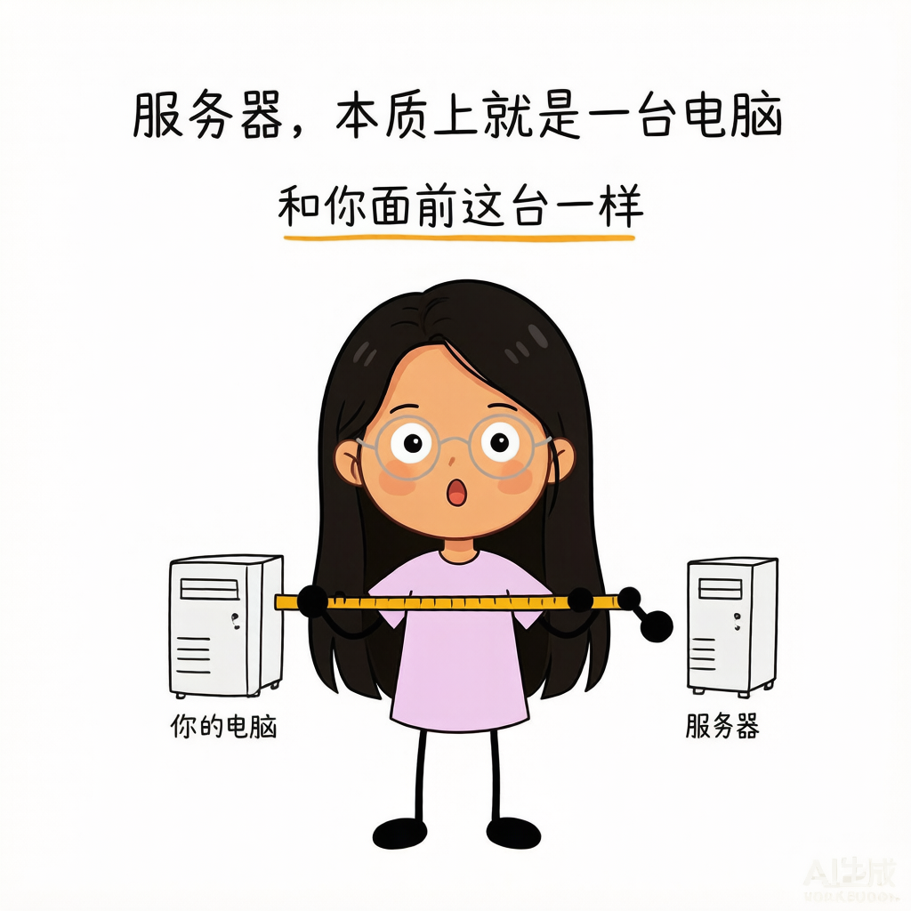
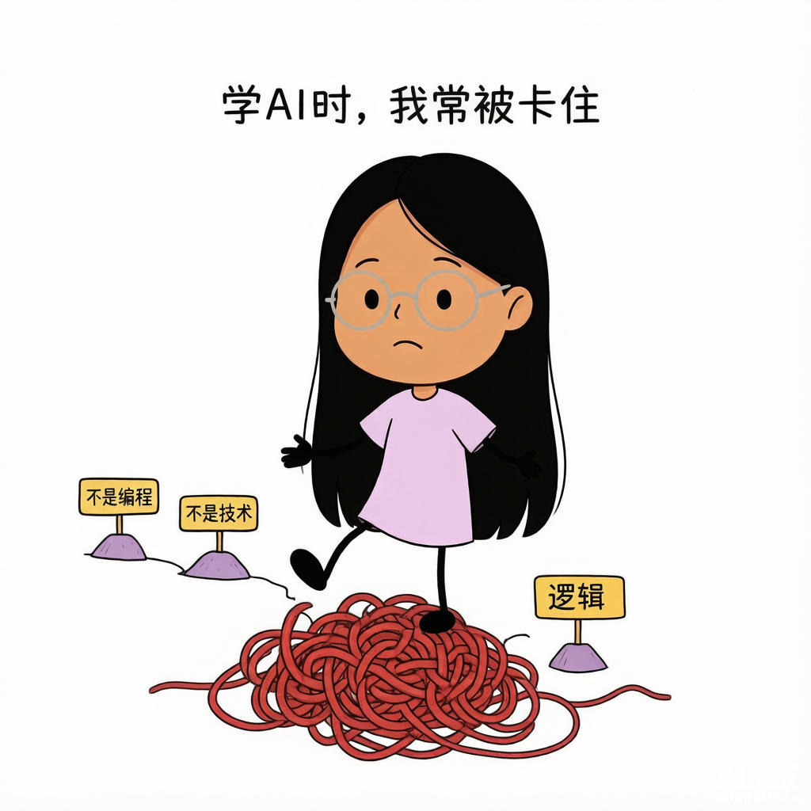
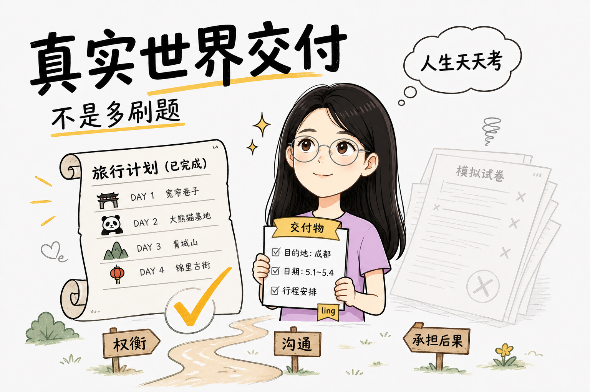

# **Ling趣味配图**

[中文](#中文) | [English](#english)

## **中文**

**把文章和视频脚本，变成有固定卡通人物、有信息、也有趣味的配图。**

> 支持文章正文插图、博客与公众号配图、视频脚本 B-roll、SRT 时间轴补图、录屏空档补画和连续镜头设计。

`文章配图`　`视频 B-roll`　`SRT 补图`　`固定卡通人物`　`连续画面`

## **示例画面**

<table>
  <tr>
    <td width="33%"></td>
    <td width="33%"></td>
    <td width="33%"></td>
  </tr>
  <tr>
    <td align="center"><b>把陌生概念拉回常识</b></td>
    <td align="center"><b>把抽象卡点变成场景</b></td>
    <td align="center"><b>把复杂过程拆给观众</b></td>
  </tr>
</table>

示例用于展示信息密度、角色参与方式和整体感觉。实际使用时会根据新内容重新设计画面，不把旧图当作固定模板。

## **一份内容，进入两条视觉生产线**

### **文章：让读者在需要停顿的地方，看见一个画面**

它可以读取文章、博客、公众号稿件、长帖、Markdown 或 Notion 内容，判断哪些段落值得配图，而不是平均地在每几段之间塞一张装饰图。

适合视觉化的内容包括观点转折、前后对比、具体场景、操作过程、情绪变化、抽象概念和关键结论。

### **视频：给脚本补上真正能剪进去的 B-roll**

它可以读取视频脚本、口播稿或 SRT，根据叙事节奏寻找缺画面的时间段，并为这些位置设计 B-roll 配图。

如果视频已有录屏，它会避开已经讲清楚的操作，只补充录屏无法承担的概念解释、情绪承接、场景建立和转场画面。涉及过程变化时，还可以生成 2–4 张连续图片，方便剪成简单帧动画。

## **输入什么，得到什么**

| 你提供 | Skill 可以交付 |
|---|---|
| 一篇文章或一个链接 | 配图位置、主题规划、shot list 和最终插图 |
| 视频脚本或口播稿 | 按段落拆分的 B-roll 配图方案与图片 |
| SRT 字幕 | 带时间码的补图计划、连续帧组和图片文件 |
| 录屏说明与已有图片 | 只补空档，不重复已经存在的画面 |
| 一个抽象观点 | 一张有文字、有角色动作、有视觉隐喻的完整配图 |
| 一张不满意的旧图 | 定向修改人物、表情、四肢、文字、颜色或构图 |

## **它控制的不是一个画风词，而是一整套稳定性**

### **固定人物**

每次生图都会同时引用身份、表情动作和配色资产，尽量固定人物的脸型、五官、发型、眼镜、服装、头身比例和颜色，不让系列图片像换了演员。

### **人物真的参与内容**

卡通人物会亲自推、拉、检查、搬运、测量、观察或承受结果。去掉人物以后，画面的表达应该明显变弱，而不是仍然完整成立。

### **图片必须传递信息**

每张图都包含适量的中文文字，用一个核心问题、判断或结论带动少量辅助短句和标签。它不会只生成一张好看的纯图，也不会把口播全文塞成课程页面。

### **连续图片不会一直用同一张脸**

生成当前图片前会记录前两张的视线、眼皮、眉毛、嘴形和头部角度。表情变化跟随当前注意对象和叙事状态，避免连续三张都使用相同侧眼或同一套表情。

### **四肢和颜色有独立验收**

人物必须保持黑色单线胳膊和腿、黑点手、黑椭圆脚。肤色手指、紫色袖管手臂、双线腿、裤腿或鞋子都会触发修正。皮肤、衣服和头发颜色也会对照固定资产检查，避免过曝、斑驳和色块不均。

### **幽默只负责让画面更好懂**

趣味来自过度认真、字面理解、尺度反差或克制的微表情。事实、方向、先后和因果仍然必须正确。

## **四种使用方式**

### **只做规划**

```text
使用 $ling-fun-illustrations，分析这篇文章哪些位置值得配图。
先不要生图，输出配图位置、核心意思、画面文字和 shot list。
```

### **生成文章插图**

```text
使用 $ling-fun-illustrations，为这篇文章设计并生成一组正文配图。
每张图只承接一个观点，保持固定卡通人物和统一视觉风格。
```

### **生成视频 B-roll 配图**

```text
使用 $ling-fun-illustrations，读取这份视频脚本，为缺少画面承接的段落生成 B-roll 配图。
请给出每张图对应的脚本位置和用途。
```

### **按 SRT 补图**

```text
使用 $ling-fun-illustrations，根据这份 SRT 和已有配图，只补尚未覆盖的时间段。
需要连续动作的部分生成 2–4 张连续画面，并交付配图时间表。
```

## **默认画面语言**

- 16:9 横版
- `#F5F5F7` 浅灰背景
- 黑色手绘线条与大量留白
- 少量芥末黄、橙色、青蓝色或红色强调
- 固定的大头小身体成年卡通人物
- 简短、清楚、有层级的中文手写文字
- 主体居中，关键内容不贴边
- 一张图只承担一个主要信息任务
- 信息准确优先，趣味表达其次

## **安装**

### **Windows**

```powershell
git clone https://github.com/lingChyi/ling-fun-illustrations.git "$HOME\.agents\skills\ling-fun-illustrations"
```

### **macOS / Linux**

```bash
git clone https://github.com/lingChyi/ling-fun-illustrations.git ~/.agents/skills/ling-fun-illustrations
```

安装后，重新打开支持 Agent Skills、参考图片输入和图片生成的客户端。

调用名称仍为：

```text
$ling-fun-illustrations
```

## **仓库内容**

```text
ling-fun-illustrations/
├── README.md
├── SKILL.md
├── agents/openai.yaml
├── assets/
│   ├── character/           # 固定人物身份、动作与配色资产
│   ├── examples/            # 构图和趣味节奏参考
│   └── showcase/            # README 展示图
└── references/
    ├── style-dna.md         # 画面风格、颜色和文字配额
    ├── ling-ip.md            # 人物一致性规则
    ├── composition-patterns.md
    ├── prompt-template.md
    └── qa-checklist.md      # 分层验收和纠错
```

## **使用边界**

- 这是配图工作流，不是封面海报、品牌 KV、复杂架构图或可编辑矢量设计工具。
- 图片模型仍有随机性，固定资产和验收流程可以降低漂移，但首次生成不一定直接合格。
- 中文偶尔可能出现错字或乱码，需要局部修正。
- 使用者需要自行核对专业知识、数字、引用、因果关系和最终发布内容。

## **使用许可**

本项目采用 [PolyForm Strict License 1.0.0](LICENSE)。

你可以免费将本项目用于个人学习、研究和其他非商业用途。未经作者书面许可，不得修改、复制发布、二次分发、转售、再授权，或用于任何商业产品和服务。

这是一项“源码公开、仅限非商业使用”的项目，不属于 OSI 定义下的开源软件。

如需商业使用或其他授权，请通过 GitHub 联系作者。

欢迎通过 GitHub Issues 提交问题、实际案例和改进建议。

---

[中文](#中文) | [English](#english)

## **English**

**Turn articles and video scripts into informative, playful illustrations built around one consistent cartoon character.**

> Designed for article illustrations, blog and newsletter visuals, script-based B-roll, SRT-timestamped image planning, screen-recording gaps, and short sequential image sets.

`Article Illustrations`　`Video B-roll`　`SRT Visuals`　`Recurring Character`　`Sequential Frames`

## **Examples**

<table>
  <tr>
    <td width="33%"></td>
    <td width="33%"></td>
    <td width="33%"></td>
  </tr>
  <tr>
    <td align="center"><b>Bring unfamiliar ideas back to common sense</b></td>
    <td align="center"><b>Turn abstract obstacles into scenes</b></td>
    <td align="center"><b>Expose the steps inside a process</b></td>
  </tr>
</table>

These images demonstrate information density, character participation, and overall visual language. New tasks receive newly designed scenes rather than copies of these examples.

## **One input, two visual production lines**

### **For reading: illustrations that give the reader a useful pause**

The Skill can read articles, blog posts, newsletters, long-form social posts, Markdown, and Notion content. It identifies the moments that benefit from a visual instead of inserting decorative images at fixed intervals.

Useful moments include shifts in argument, comparisons, concrete scenes, processes, emotional changes, abstract ideas, and key conclusions.

### **For editing: B-roll that can actually enter the timeline**

The Skill can read video scripts, voice-over drafts, and SRT subtitles, locate sections with weak visual coverage, and design B-roll illustrations for those exact moments.

When screen recordings already explain the interface, it avoids duplicating them. It focuses on ideas, emotional bridges, context-setting, and transitions that recordings cannot carry. Processes and state changes can be expanded into 2–4 continuity-aware images for simple frame animation.

## **What goes in, what comes out**

| Input | Possible output |
|---|---|
| An article or URL | Illustration positions, shot list, and final images |
| A video or voice-over script | Paragraph-level B-roll plan and illustrations |
| SRT subtitles | Timestamped visual plan, sequential frame groups, and image files |
| Screen-recording notes and existing images | Gap-only additions without repeating finished visuals |
| One abstract claim | A complete scene with a visual metaphor, character action, and text |
| An unsatisfactory image | Targeted correction of identity, expression, limbs, text, color, or layout |

## **More than a style prompt**

### **A recurring character, not a new actor in every frame**

Every generation uses identity, expression, action, and color references to preserve facial structure, features, hair, glasses, clothing, proportions, and color treatment across a series.

### **The character participates in the meaning**

The character pushes, pulls, checks, carries, measures, observes, or experiences the result. Removing the character should weaken the explanation rather than leave the scene unchanged.

### **Every image carries information**

Each illustration contains a concise amount of Chinese information copy: one core question, judgment, or conclusion, supported by a few short phrases and necessary labels. It avoids both text-free decoration and slide-like text walls.

### **Sequential images do not reuse the same face endlessly**

Before generating a new frame, the Skill records the previous two gaze directions, eyelids, eyebrows, mouth shapes, and head angles. Expression changes follow the current object of attention and narrative state.

### **Limbs and colors have their own validation gates**

The character uses thin black single-line arms and legs, black dot hands, and black oval feet. Sleeve-shaped arms, skin-colored fingers, double-line legs, trousers, or shoes trigger correction. Skin, clothing, and hair colors are also checked against fixed assets to reduce overexposure, mottling, and uneven fills.

### **Humor serves comprehension**

The playful beat may come from excessive seriousness, literal interpretation, scale contrast, or a restrained reaction. Facts, sequence, direction, and causality remain accurate.

## **Four ways to use it**

### **Plan only**

```text
Use $ling-fun-illustrations to identify where this article needs illustrations.
Do not generate images yet. Return placement, core idea, on-image copy, and a shot list.
```

### **Generate article illustrations**

```text
Use $ling-fun-illustrations to design and generate a set of inline illustrations for this article.
Let each image carry one idea and preserve the same recurring cartoon character.
```

### **Generate script-based B-roll**

```text
Use $ling-fun-illustrations to read this video script and create B-roll illustrations for sections that lack visual support.
Map every image to its script position and editing purpose.
```

### **Fill an SRT timeline**

```text
Use $ling-fun-illustrations with this SRT and the existing image list. Fill only uncovered timestamps.
Create 2–4 sequential frames where an action needs visual progression, and return a timestamped image plan.
```

## **Default visual language**

- 16:9 landscape format
- Uniform `#F5F5F7` light-gray background
- Black hand-drawn linework and generous negative space
- Limited mustard yellow, orange, muted teal, or red accents
- One consistent adult cartoon character with an oversized head and small body
- Concise, readable, hierarchically arranged Chinese handwriting
- Centered subjects with safe margins
- One primary communication task per image
- Accuracy first, playfulness second

## **Installation**

### **Windows**

```powershell
git clone https://github.com/lingChyi/ling-fun-illustrations.git "$HOME\.agents\skills\ling-fun-illustrations"
```

### **macOS / Linux**

```bash
git clone https://github.com/lingChyi/ling-fun-illustrations.git ~/.agents/skills/ling-fun-illustrations
```

Restart a client that supports Agent Skills, reference-image input, and image generation.

The invocation name remains:

```text
$ling-fun-illustrations
```

## **Repository contents**

```text
ling-fun-illustrations/
├── README.md
├── SKILL.md
├── agents/openai.yaml
├── assets/
│   ├── character/           # Character identity, action, and color assets
│   ├── examples/            # Composition and comedy-rhythm references
│   └── showcase/            # README showcase images
└── references/
    ├── style-dna.md         # Visual language, colors, and text budget
    ├── ling-ip.md            # Character consistency rules
    ├── composition-patterns.md
    ├── prompt-template.md
    └── qa-checklist.md      # Layered validation and correction
```

## **Limitations**

- This is an illustration workflow, not a cover-poster, brand-key-visual, complex-architecture-diagram, or editable-vector design tool.
- Image generation remains stochastic. Fixed assets and validation reduce drift but do not guarantee a perfect first result.
- Generated Chinese text may occasionally require local correction.
- Users remain responsible for verifying domain facts, figures, citations, causal relations, and all final published content.

## **License**

This project is licensed under the [PolyForm Strict License 1.0.0](LICENSE).

You may use it free of charge for personal study, research, and other noncommercial purposes. Without prior written permission from the author, you may not modify, redistribute, republish, sell, sublicense, or use it in any commercial product or service.

This project is source-available for noncommercial use. It is not open-source software as defined by the OSI.

For commercial use or other licensing requests, contact the author through GitHub.

Questions, real-world examples, and improvement proposals are welcome through GitHub Issues.
